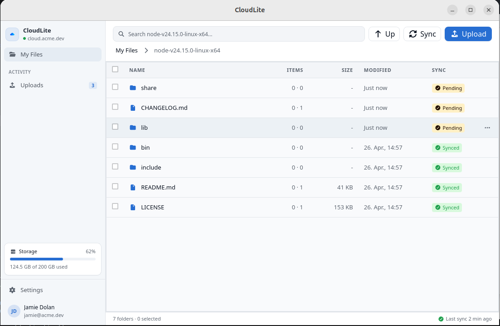

# CloudLite Frontend

CloudLite Frontend is a Tauri desktop app built with Vue and TypeScript. It is part of CloudLite, a lightweight self-hosted cloud storage project inspired by Nextcloud-style file sync, built mainly for learning and experimentation.

The app provides the client UI for logging in, browsing synced files and folders, and sending local file or directory actions to the Rust backend.



## Scope

- [ ] Provide a desktop application shell using Tauri, Vue, and TypeScript.
- [ ] Authenticate users through the CloudLite Keycloak OAuth2 flow.
- [ ] Browse synchronized files and folders in the desktop UI.
- [ ] Accept local files and folders through drag-and-drop ingestion.
- [ ] Synchronize changes with the CloudLite backend.
- [ ] Execute filesystem and synchronization commands through the Rust/Tauri backend.

CloudLite backend repository: [cloudlite-backend](https://github.com/kr1pt0n05/cloudlite-backend)

## Architecture

- Vue.js and TypeScript provide the desktop UI.
- Tauri wraps the web UI as a desktop app and exposes native APIs.
- Rust handles local backend commands, filesystem access, and sync orchestration.
- SQLite stores local sync metadata and changelog state.
- Keycloak OAuth2 is used for authentication.

## Setup

### Prerequisites

Install the following before starting:

- Node.js with npm.
- The Rust toolchain (`rustup` and `cargo`).
- The platform dependencies required for a Tauri 2 application: [Tauri prerequisites](https://v2.tauri.app/start/prerequisites/).
- A running CloudLite backend available at `http://localhost:8000/api`.
- A Keycloak development realm available at `http://localhost:8080/realms/development`, configured with the `frontend-client` client and `http://localhost:4200` as an allowed redirect URL.

### Run the Application

1. Clone the repository and enter the frontend directory:

   ```bash
   git clone <repository-url>
   cd cloudlite-frontend
   ```

2. Install the frontend dependencies from the committed lockfile:

   ```bash
   npm ci
   ```

3. Check the development configuration files. The repository currently provides these defaults:

   ```dotenv
   # .env
   VITE_AUTHORIZATION_REDIRECT_TIMEOUT_SECONDS=300
   ```

   ```dotenv
   # src-tauri/.env
   DATABASE_URL=sqlite:./dev.db
   ```

4. Start the CloudLite backend and Keycloak instance described in the prerequisites.

5. Launch the desktop application from the repository root:

   ```bash
   npm run tauri -- dev
   ```

6. Confirm that the application opens, redirects to the Keycloak login flow, and can access the backend after authentication.

To verify that the web frontend compiles independently, run:

```bash
npm run build
```

Development note: the current Tauri startup code drops local database tables and removes the local base directory on each application launch.

## Commands

```bash
npm run dev          # Start only the Vite web development server
npm run build        # Type-check and build the frontend
npm run tauri -- dev # Run the desktop app in development mode
```
